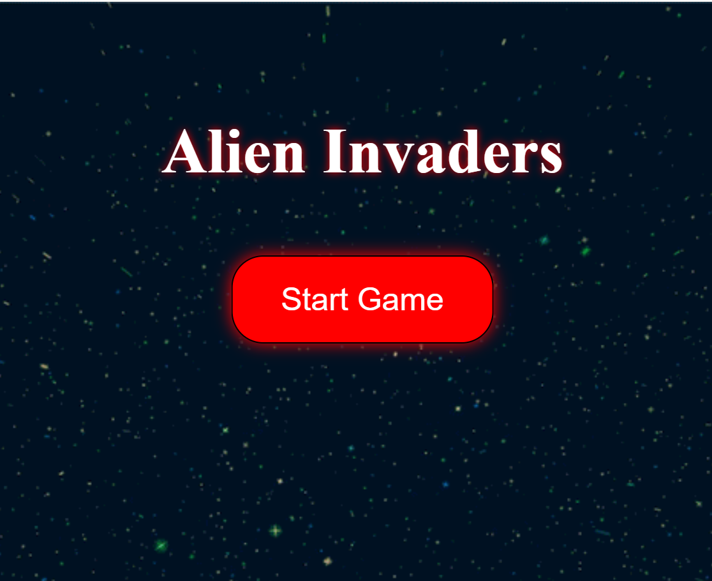
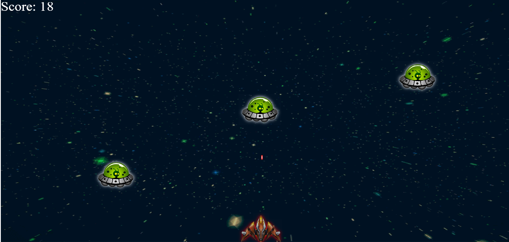

# Alien-Invaders-Game

### Task:

Making a fully functional space-invader game called "Alien Invaders".

### Purpose:

Improving my software development, design, and game development skills while building a fun game in the process.

Also adding additional functionalities and refactoring my code for simplicity.

### Languages:

HTML, JavaScript (styling done entirely using JavaScript)

### Hosting:

Github Pages

### How To Play:

Move your mouse to move your player and align yourself with an enemy. Then, shoot lasers at the enemy with your space bar to score points.

### Live Demo:

https://mtemkit.github.io/

Early stages of development:

   
  

### Next Steps / Future Changes:

- Add a pause and resume functionality.

- Add a "play again" functionality.

- Better color and design for the player, enemy, and background.

- More effects to add during collisions.

- Sound off/on buttons throughout gameplay.

- Game Over sound effect and signal once an alien touches the floor.

- Game Over Screen.

- Celebration for each x10 milestone (level up sound effect, and randomly chosen congratularly image).

- Game mp3 music made loopable beyond its length.

- Music autoplay when it's first loaded.

- Refactoring to ES6.